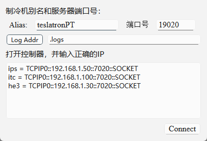
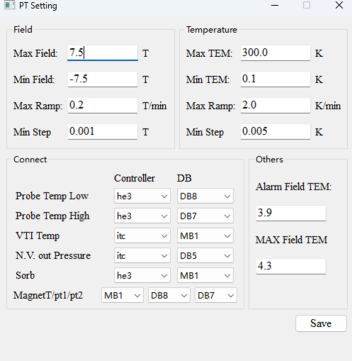
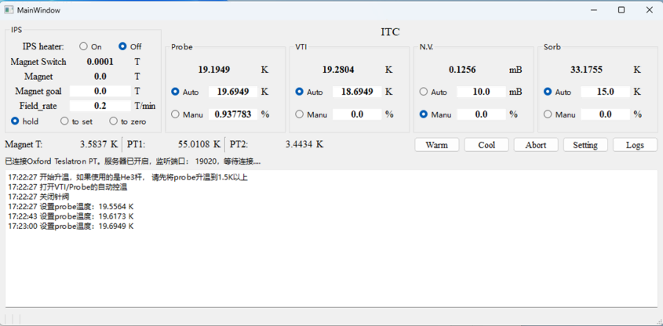

# OxfordPTController
A GUI program for controlling Oxford testralonPT refrigeration 
不同设备配置可能需要适当修改代码

需要安装　NI 驱动　(ni-488.2XXX offline)
"https://www.ni.com/en/support/downloads/drivers/download.ni-488-2.html#575749"

#　安装信赖包
```console
pip install numpy==2.2.4
pip install pyside6==6.8.2.1
pip install matplotlib==3.10.1
pip install pyvisa==1.14.1
```
# 使用
1. run pt_controller.py 中的main函数
2. 点 **Log Addr** 选择用于存放Log files的文件夹
3. 输入三个控制器的地址，示例中使用的是LAN口，ips为磁体控制器的地址，itc/he3为1.5K杆和He3插杆温控地址。
4. 单击 connect
5. 


如果是第一次使用，弹出设置窗口，根据实际情况进行设置。 
如果已经设置过，在主窗口中点setting可修改设置。



如果之前已经设置过 setting，会弹出主窗口：




# API使用 示例
首先需要运行控制程序，并与制冷机建立连接。

```jupyter
from api_for_PT_controller import PTClient
client = PTClient("localhost", 19020)
```

```jupyter
client.get_magnet()
```

```jupyter
client.get_temperature()
```

更多请查看api_for_PT_controller.py文件


